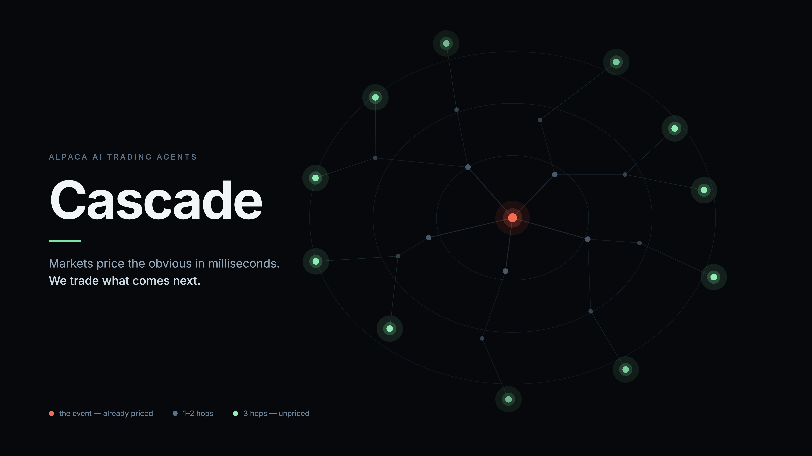

# Cascade

**Markets price the obvious in milliseconds. We trade what comes next.**

An autonomous trading agent for the **Alpaca AI Trading Agents Hackathon**
(28 Aug – 4 Sep 2026). One-page write-up: **[SUBMISSION.md](SUBMISSION.md)**.

A fab burns down and that ticker gaps before any human reacts. But the
*propagation* — who buys those chips, whose guidance is now at risk, which
supplier three steps out is materially exposed — takes hours to days. That gap
is not a prediction problem. It is a knowledge-and-relationship problem, and it
is the one thing a language model does better than any existing trading system.

> Cascade trades the ripple, not the splash.

---

## The one rule

**Every hop cites a source. Not in the graph → does not exist → no trade.**

Cascade does not ask a model what companies are related. It mines relationships
from **the filers' own XBRL concentration facts** — structured data companies
tag themselves in their 10-K, with the counterparty, the share of revenue and
the fiscal period attached. Every edge carries an SEC accession number and a URL.

That matters more than it sounds. Under **ASC 280-10-50-42** a company with a
≥10% customer *must* disclose the amount — and explicitly **need not disclose
the identity**. So when a filer names General Motors at 21.7%, that identity is
volunteered: a materiality judgement the filer made and signed. We only trade
dependencies filers chose to put their name on.

*(The old Reg S-K Item 101(c)(1)(vii) rule that compelled naming 10%+ customers
was repealed in the SEC's November 2020 modernisation. We do not claim it.)*

---

## How it works

```
 ┌── EDGAR ──────────┐        ┌── Alpaca ─────────┐        ┌── xAI Grok ───────┐
 │ 10-K XBRL facts   │        │ news · bars       │        │ triage            │
 │ concentration     │        │ orders · account  │        │ edge adjudication │
 └─────────┬─────────┘        └─────────┬─────────┘        └─────────┬─────────┘
           │                            │                            │
           ▼                            ▼                            ▼
 ┌─────────────────────────────────────────────────────────────────────────────┐
 │  CASCADE DAEMON  (Node, long-running)                                       │
 │    1  watch news on graph hubs                                              │
 │    2  triage        is this a material event, or commentary?                │
 │    3  propagate     hub → every disclosed dependent                         │
 │    4  gate          type · positionable · materiality · liquidity · priced-in│
 │    5  size          exposure × confidence, capped                           │
 │    6  execute       Alpaca paper orders                                     │
 │    7  exit          when the residual arrives, or the thesis breaks         │
 └───────────────┬──────────────────────────────┬──────────────────────────────┘
                 ▼                              ▼
         web UI + API (:8787)            MCP server (stdio)
```

### The edge: a vol-normalised priced-in check

"Has this already moved?" cannot be answered with a percentage. A 6% move is
noise for a semicap name and a catastrophe for a food producer — and half of any
move is usually the market and sector carrying the stock along.

```
residual = actual return − (market β + sector β explain)
z        = residual ÷ (residual volatility × √periods)
```

- **|z| < 1σ** → exposed and unmoved. **This is the trade.**
- **|z| > 2σ** → already priced. We are late.
- Moving *against* the thesis is reported as contradicted, not as headroom.

The same statistic is the exit trigger: the thesis is spent when the residual
finally arrives. One piece of maths doing two jobs.

Verified by test: a stock **up 7.5%** where the whole move is a 5% market rally
scores **z = −0.31 → unpriced**. A flat "moved >6%, too late" rule discards it.

### Five gates, and every refusal is output

An agent that only reports what it bought is not legible. Cascade reports what
it refused and why:

| Gate | Refuses when | Why it exists |
|---|---|---|
| `relationship_type` | edge type is `unknown` | an untyped edge fires on the wrong events |
| `positionable` | dependent is not on a tradeable exchange | avoids orders the broker rejects |
| `materiality` | exposure < 5% of revenue | below this it is noise, not a dependency |
| `liquidity` | median daily volume < $2M | **"unmoved" must not mean "untraded"** |
| `priced_in` | \|z\| ≥ 1σ | the market already has it |
| `shock_type` | this shock doesn't travel this edge | a real dependency, wrong channel |

The liquidity gate is the one that matters most. Without it, "materially exposed
and hasn't moved" systematically selects illiquid names — the fatal demo bug. In
a live Amazon cascade it refused 6 of 11 dependents, including one trading
$0.01M a day.

### Typed edges — the physics of a relationship

Every disclosed dependency is real. What differs is **which shock travels along
it**. Rivian tags Chase Bank at 36% of revenue as customer concentration; Chase
originates its retail financing. A tariff does not travel that edge — a lender
exiting auto lending does.

| type | transmits | fires on |
|---|---|---|
| `customer` | demand | guidance cuts, lost programmes |
| `conduit_financing` | credit availability | a lender exits, a rate shock |
| `conduit_distribution` | route-to-market | platform fees, delisting |
| `government` | appropriations | budgets, shutdowns, awards |
| `unknown` | — | **blocked from trading** |

The clearest case in our graph: **Duolingo derives 61.6% of revenue through
Apple's App Store.** An iPhone recall is irrelevant to Duolingo. An App Store
commission change is existential. Same edge, opposite answers — which is exactly
why the enum exists.

Types are assigned **once at ingest**, never re-decided at trade time. Live, on
the real graph:

```
DUOL → AAPL   conduit_distribution   0.95
              "Apple provides platform, takes commission, not ownership"
JAKK → TGT    customer               0.99
              "Target buys inventory, takes ownership"
```

The ownership test is what separates them: a retailer buying wholesale is a
customer whose demand *is* your demand; a platform taking a commission is a
conduit. Then, per event:

```
blocked   DUOL←AAPL   "Apple recalls iPhone 17 over battery defect"
TRAVELS   DUOL←AAPL   "Apple cuts App Store commission to 15% under DMA ruling"
blocked   DUOL←AAPL   "Apple reports record iPhone sales in China"
TRAVELS   SMG←HD      "Home Depot cuts guidance on weak housing demand"
```

---

## Quick start

```bash
npm install
cp .env.example .env          # then fill in the keys below
npm test                      # 24 checks, no keys needed
npm start                     # web UI on http://localhost:8787
npm run daemon                # the autonomous agent
```

### Keys

| Variable | Needed for | Where |
|---|---|---|
| `ALPACA_API_KEY_ID` / `ALPACA_API_SECRET_KEY` | prices, news, execution | [app.alpaca.markets](https://app.alpaca.markets) → select the **Paper** account (top-left) → **API Keys** → Generate |
| `GROQ_API_KEY` **or** `XAI_API_KEY` | triage + edge adjudication | [console.groq.com](https://console.groq.com) or [x.ai/api](https://x.ai/api) |
| `SEC_CONTACT` | EDGAR fair-access policy requires a contact address | any email you own |
| `TELEGRAM_BOT_TOKEN` / `TELEGRAM_CHAT_ID` | optional feed | @BotFather → token; message the bot, then read `chat.id` from `/getUpdates` |

> **Groq and Grok are different companies.** Groq is an inference provider
> serving open models (Llama, Qwen, gpt-oss) at `api.groq.com`; Grok is xAI's
> own model at `api.x.ai`. Both are OpenAI-compatible, so Cascade supports
> either — set whichever key you have and it detects the provider.

Alpaca **paper** accounts need only an email — no brokerage application, no ID.
MFA must be enabled before the dashboard shows API keys.

Without keys nothing is faked: the graph, the gates and the UI all work, and the
system reports which parts are unpowered rather than implying a judgement.

### Models

Two stages, so cost is bounded by construction — the expensive model only ever
sees events that survived the cheap one.

| Stage | Model (Groq) | Runs on |
|---|---|---|
| Triage | `openai/gpt-oss-20b` | every headline |
| Adjudication | `openai/gpt-oss-120b` | each edge once at ingest; each candidate on a live event |

Models are **resolved against the provider's live `/models` list**, not
hardcoded — IDs get retired, and a stale default fails on the first real call
rather than at startup. Override with `TRIAGE_MODEL` / `ADJUDICATOR_MODEL`; a
configured-but-unavailable model is reported, never silently swapped.

Reasoning models sometimes emit their reasoning before the JSON, which Groq's
strict mode rejects server-side. The client asks for a constrained schema first,
retries free-form on failure, and extracts the object from whatever came back.

---

## Commands

```bash
npm start              # web UI + API            :8787
npm run start:all      # web UI + daemon in one process (what Railway runs)
npm run daemon         # autonomous agent loop, standalone
npm run mcp            # MCP server over stdio
npm test               # extraction, maths and gate tests

npm run build:graph    # merge mined sources → data/graph.json
npm run adjudicate     # assign relationship types with Grok
npm run mine:hub -- "Walmart|Walmart Inc." "Home Depot|The Home Depot"
npm run survey         # sector naming-rate survey

npm run cascade -- HD 2026-08-25 down "headline"          # score one event
npm run trade   -- HD 2026-08-25 down "headline" --live   # and submit orders
npm run telegram:test                                     # verify the feed
```

Daemon environment: `AUTO_TRADE=true` to submit orders (default dry run),
`POLL_MS` for cadence, `MAX_CASCADES` per cycle.

---

## Files

### Mining — build the graph
| File | Purpose |
|---|---|
| `src/mining/sec.mjs` | EDGAR client: throttling, retries, filing cache |
| `src/mining/xbrl.mjs` | **Primary extractor.** Concentration facts with four guards |
| `src/mining/extract.mjs` | HTML prose/table fallback for filers who don't tag |
| `src/mining/resolve.mjs` | Company names → tickers, exact match only |
| `src/mining/canonical.mjs` | Merges `Ford` / `Ford Motor Company`; exchange tradeability |
| `src/mining/universe.mjs` | Sector universes from SIC codes |
| `src/mining/ambiguous-keys.json` | Company names that collide with English words |

### Market — price the event
| File | Purpose |
|---|---|
| `src/market/alpaca.mjs` | Bars, news, orders, positions; SIP delay clamp |
| `src/market/residual.mjs` | The priced-in check and the exit trigger |
| `src/market/sectors.mjs` | SIC → sector ETF for the factor model |

### Engine — decide and act
| File | Purpose |
|---|---|
| `src/engine/cascade.mjs` | Propagation, the five gates, the refusal log |
| `src/engine/execute.mjs` | Sizing by exposure × confidence; whole-share shorts |
| `src/engine/triage.mjs` | Stage-one routing: Grok, or the deterministic classifier |
| `src/llm/client.mjs` | Provider-agnostic LLM (Groq or xAI), both stages, usage tracking |
| `src/env.mjs` | Shared `.env` loader used by every entry point |

### Surfaces
| File | Purpose |
|---|---|
| `src/daemon.mjs` | The agent loop |
| `src/web/server.mjs` | API + static server, `/healthz` build marker |
| `src/web/public/index.html` | The UI |
| `src/mcp/server.mjs` | MCP over stdio — 4 tools |
| `src/notify/telegram.mjs` | Cascade feed: each firing, with citations and refusals |

### Scripts
`build-graph` · `adjudicate-graph` · `hub-mine` · `deep-mine` · `survey` ·
`analyse-hubs` · `cascade` · `trade` · `validate-extractor` ·
`test-guards` · `test-residual` · `test-cascade` · `build-ambiguous-keys`

---

## MCP server

The organisers named MCP the core of the theme. Cascade's causal engine is
useful to any agent, not just ours:

| Tool | Returns |
|---|---|
| `cascade_downstream` | who depends on a company, with share, period and accession number |
| `cascade_upstream` | what a company depends on, and how concentrated it is |
| `cascade_run` | propagate an event, score priced-in, return positions **and refusals** |
| `cascade_graph_stats` | graph coverage and hub ranking |

```json
{
  "mcpServers": {
    "cascade": { "command": "node", "args": ["/absolute/path/to/Cascade/src/mcp/server.mjs"] }
  }
}
```

It refuses to speculate: ask about a company with no mined edges and it says so,
rather than inventing a plausible supply chain.

---

## API

| Endpoint | Returns |
|---|---|
| `GET /healthz` | commit, uptime, edge count, gate config, Alpaca + LLM status |
| `GET /api/graph` | the full causal graph |
| `GET /api/hubs` | hubs ranked by inbound dependents |
| `GET /api/cascade?hub=WMT&direction=down` | live cascade with z-scores and refusals |
| `GET /api/portfolio` | equity, open positions, P/L |
| `GET /api/news` | Benzinga headlines on graph hubs |
| `GET /api/journal` | what the daemon did, refusals included |

---

## What we found while building this

The graph was measured, not assumed — and the measurements overturned three
assumptions we started with.

- **Auto suppliers name customers at 63%; semiconductors only 20%.** Semis tag
  concentration diligently and then anonymise it. Our early confidence in semis
  came from two filers we had picked *because* we knew they named.
- **Hub-first mining beats supplier-first by ~6×.** Mining a sector and hoping
  hubs accumulate gave a top-hub in-degree of 5. Naming the hub and searching for
  filers that cite it gave Walmart **16**.
- **Discovery ranking hid whole hubs.** Searching `"Target Corporation"` returns
  Target's own filings first, so its suppliers fell below the result budget and
  Target scored zero. Requiring concentration language alongside the name fixed it.

Four bugs in this project were silent and asymmetric — they returned plausible
numbers while answering a different question. Inline XBRL splits percentages
(`46 %`), so a prose regex missed every tagged fact; a prose-only extractor is
blind to table disclosure; sector-scoped in-degree measured the mining strategy
rather than the graph. Each was caught by spot-checking a filer we were confident
should hit, and treating a zero as a bug until proven otherwise.

---

## Deliberate limits

- **We prove the mechanism, not the P&L.** Seven days of paper trading cannot
  establish edge. Any equity curve from that window is noise, and presenting it
  as returns would be dishonest.
- **Delayed consolidated data, on purpose.** The free tier serves SIP 15 minutes
  delayed. Our edge horizon is hours, so a mechanism needing tick data would
  contradict its own thesis. IEX is real-time but a few percent of volume —
  exactly the wrong trade-off for the mid-caps three hops out.
- **Anonymous counterparties are never resolved by inference.** Everyone knows
  SiTime's "Customer One" at 26% is Apple. It stays untradeable. One inferred hop
  makes the citation rule decorative.
- **Aggregates become ceilings, not weights.** A member fusing three companies at
  41.9% is stored with `magnitudeCeiling` and low confidence — splitting it would
  be inventing numbers.

---

## Deploy

Railway, **one service** running the web app and the agent together — one health
endpoint, no drift between what the UI shows and what the agent did.

```bash
railway login
railway init
railway up
```

`railway.json` sets `RUN_DAEMON=true node src/web/server.mjs` and a `/healthz`
check. Then set the variables in the Railway dashboard:

```
ALPACA_API_KEY_ID · ALPACA_API_SECRET_KEY · GROQ_API_KEY · SEC_CONTACT
AUTO_TRADE=true            # omit to keep the deployed agent in dry run
TELEGRAM_BOT_TOKEN · TELEGRAM_CHAT_ID   # optional
```

`/healthz` carries the commit SHA, uptime, edge count, gate config and whether
Alpaca and the LLM are actually reachable — so you can always prove which code
is live rather than assuming the deploy landed.

### Telegram

Each cascade as it fires, with the exposure, the residual, the citation, and
what was refused:

```
⚡ HD ▼ cascade
Home Depot sees no sign of housing recovery

5 positions
SMG    34.0% of revenue via HD · 0.81σ unmoved
   ↳ cited 0000825542-25-000022
…
refused 2
SWK    priced_in — partially priced at 1.44σ
UE     priced_in — drifting 1.13σ against the thesis
```

---

*SecureFlow made escrow trustworthy. Patron made an AI employer trustworthy.
Cascade makes an autonomous trader legible — every position explains itself,
sourced, before it is taken.*
